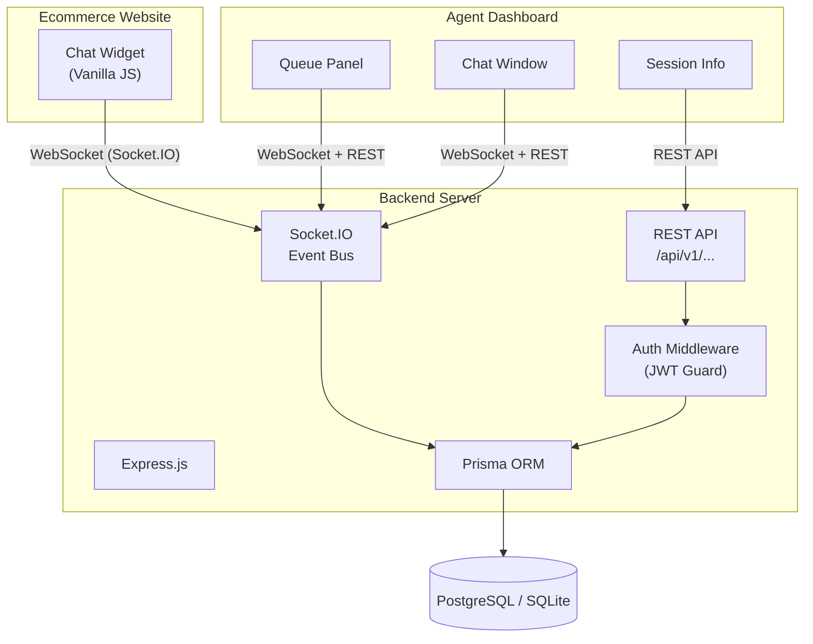

# 📋 Technical Specification
## Project: Real-Time Customer Support Chat — Ecommerce Platform

> **Status:** 🟡 Awaiting Approval
> **Version:** 2.0
> **Author:** Product Manager (@pm)
> **Date:** 2026-05-19

---

## 1. Executive Summary

This document specifies a **production-ready, real-time customer support chat system** designed for embedding into any ecommerce website. The primary goal is to provide shoppers with instant, low-latency support directly on the storefront — improving conversion rates, reducing cart abandonment, and boosting customer satisfaction.

The system consists of three core components:

1. **Customer-Facing Chat Widget** — A zero-dependency, embeddable Vanilla JS widget loadable via a single `<script>` tag on any page.
2. **Agent Dashboard** — A React 18 + Vite application where support staff manage multiple concurrent conversations in real-time.
3. **Backend Server** — A Node.js/Express + Socket.IO server handling real-time message relay, REST API, JWT authentication, and database persistence via Prisma ORM.

**Key Differentiator:** Self-hosted, no vendor lock-in, full control over the event model and data.

---

## 2. Requirements

### 2.1 Functional Requirements

| ID   | Requirement                                                                 | Priority |
|------|-----------------------------------------------------------------------------|----------|
| F-01 | Customers can initiate a chat session from any page of the ecommerce site   | P0       |
| F-02 | Messages are delivered in **real-time** (< 200ms round-trip latency)        | P0       |
| F-03 | Support agents have a dashboard to see all **active chat queues**           | P0       |
| F-04 | Agents can accept, reply to, and close chat sessions                        | P0       |
| F-05 | Full **chat history** is persisted and viewable per conversation             | P0       |
| F-06 | Customer can optionally provide name & email before starting a chat         | P1       |
| F-07 | Typing indicators ("Agent is typing...") shown to both parties              | P1       |
| F-08 | Read receipts for agent messages                                            | P1       |
| F-09 | System messages for session start, end, and agent assignment                | P0       |
| F-10 | Chat widget displays agent name and avatar when connected to a live agent   | P1       |
| F-11 | Offline fallback: if no agent is available, capture email for follow-up     | P1       |
| F-12 | Agents can tag/close/transfer sessions                                      | P2       |
| F-13 | **Canned responses**: Agents can use pre-saved quick replies                | P1       |
| F-14 | **Sound notifications**: Audible alerts for new messages and new sessions   | P1       |
| F-15 | **Unread badge count** on the widget icon when minimized                    | P1       |

### 2.2 Non-Functional Requirements

| ID    | Requirement                                                         |
|-------|---------------------------------------------------------------------|
| NF-01 | **Sub-200ms** message delivery latency under normal load            |
| NF-02 | Support **500+ concurrent** chat sessions                           |
| NF-03 | **99.9% uptime** SLA target                                         |
| NF-04 | Mobile-responsive chat widget (works on iOS Safari, Android Chrome) |
| NF-05 | Full **accessibility** compliance (ARIA labels, keyboard navigation) |
| NF-06 | Secure WebSocket connections (WSS) in production                    |
| NF-07 | Rate limiting to prevent message spam (max 20 msgs/min per session) |
| NF-08 | Data at rest encrypted in the database                              |
| NF-09 | **Graceful reconnection** — auto-reconnect on network drops         |
| NF-10 | Widget JS bundle < **30KB gzipped**                                  |

---

## 3. Architecture & Tech Stack

### 3.1 Selected Stack

| Layer               | Technology                         | Rationale                                                              |
|---------------------|------------------------------------|------------------------------------------------------------------------|
| **Frontend Widget** | Vanilla JS + CSS (no framework)    | Zero-dependency, embeddable on any site via a single `<script>` tag    |
| **Agent Dashboard** | React 18 + Vite                    | Component-driven, fast HMR for dashboard complexity                    |
| **Backend**         | Node.js 20 + Express + Socket.IO   | Industry-standard for real-time bidirectional events, huge ecosystem   |
| **Database**        | SQLite (dev) / PostgreSQL (prod)   | Full SQL support for relational conversation history                   |
| **ORM**             | Prisma                             | Type-safe schema management and migrations                             |
| **Auth (Agents)**   | JWT (JSON Web Tokens)              | Stateless, scalable agent authentication                               |

> **Why not Firebase/Supabase Realtime?** This spec targets a self-hosted, cost-controlled solution with no vendor lock-in. Socket.IO gives full control over the event model.

### 3.2 System Architecture Diagram



### 3.3 Directory Structure

```
app_build/
├── backend/
│   ├── src/
│   │   ├── index.js            # Entry point — Express + Socket.IO bootstrap
│   │   ├── socket/
│   │   │   └── events.js       # All Socket.IO event handlers
│   │   ├── routes/
│   │   │   ├── auth.js         # POST /api/v1/auth/login
│   │   │   ├── sessions.js     # GET /api/v1/sessions, PATCH /api/v1/sessions/:id
│   │   │   └── messages.js     # GET /api/v1/sessions/:id/messages
│   │   ├── middleware/
│   │   │   └── authGuard.js    # JWT verification middleware
│   │   └── prisma/
│   │       └── schema.prisma   # Database schema
│   ├── .env.example
│   └── package.json
│
├── dashboard/                  # React Agent Dashboard
│   ├── src/
│   │   ├── App.jsx
│   │   ├── main.jsx
│   │   ├── index.css
│   │   ├── components/
│   │   │   ├── ChatQueue.jsx
│   │   │   ├── ChatWindow.jsx
│   │   │   ├── MessageBubble.jsx
│   │   │   └── AgentHeader.jsx
│   │   ├── pages/
│   │   │   ├── Login.jsx
│   │   │   └── Dashboard.jsx
│   │   └── hooks/
│   │       └── useSocket.js
│   ├── index.html
│   ├── vite.config.js
│   └── package.json
│
└── widget/
    ├── chat-widget.js          # Self-contained embeddable widget
    ├── chat-widget.css         # Widget styles (injected by JS)
    └── demo.html               # Demo page showing widget integration
```

---

## 4. Data Models (Prisma Schema)

```prisma
generator client {
  provider = "prisma-client-js"
}

datasource db {
  provider = "sqlite"
  url      = env("DATABASE_URL")
}

model Agent {
  id           String    @id @default(cuid())
  name         String
  email        String    @unique
  passwordHash String
  avatarUrl    String?
  sessions     Session[]
  createdAt    DateTime  @default(now())
}

model Session {
  id            String    @id @default(cuid())
  customerName  String?
  customerEmail String?
  status        String    @default("QUEUED")
  agentId       String?
  agent         Agent?    @relation(fields: [agentId], references: [id])
  messages      Message[]
  tags          String    @default("[]")
  createdAt     DateTime  @default(now())
  closedAt      DateTime?
}

model Message {
  id        String   @id @default(cuid())
  sessionId String
  session   Session  @relation(fields: [sessionId], references: [id])
  sender    String
  content   String
  readAt    DateTime?
  createdAt DateTime @default(now())
}
```

> **Note:** SQLite doesn't support native enums or array types. `status` uses String with validation (`QUEUED`, `ACTIVE`, `CLOSED`), `sender` uses String (`CUSTOMER`, `AGENT`, `SYSTEM`), and `tags` stores as JSON string.

---

## 5. Socket.IO Event Contract

### Customer → Server

| Event           | Payload                    | Description                      |
|-----------------|----------------------------|----------------------------------|
| `session:start` | `{ name?, email? }`        | Customer initiates a new session |
| `message:send`  | `{ sessionId, content }`   | Customer sends a message         |
| `typing:start`  | `{ sessionId }`            | Customer starts typing           |
| `typing:stop`   | `{ sessionId }`            | Customer stops typing            |

### Agent → Server (authenticated)

| Event            | Payload                    | Description                      |
|------------------|----------------------------|----------------------------------|
| `session:accept` | `{ sessionId }`            | Agent claims a queued session    |
| `session:close`  | `{ sessionId, tags? }`     | Agent closes the session         |
| `message:send`   | `{ sessionId, content }`   | Agent sends a message            |
| `typing:start`   | `{ sessionId }`            | Agent typing indicator           |
| `typing:stop`    | `{ sessionId }`            | Agent stops typing               |

### Server → Client (Broadcast)

| Event              | Payload                           | Description                    |
|--------------------|-----------------------------------|--------------------------------|
| `session:queued`   | `{ session }`                     | New session added to queue     |
| `session:assigned` | `{ session, agent }`              | Session assigned to agent      |
| `message:received` | `{ message }`                     | New message delivered          |
| `typing:indicator` | `{ sessionId, sender, isTyping }` | Typing state change            |
| `session:closed`   | `{ sessionId }`                   | Session terminated             |
| `message:read`     | `{ messageId, readAt }`           | Read receipt confirmation      |

---

## 6. REST API Endpoints

| Method | Endpoint                        | Auth | Description                      |
|--------|---------------------------------|------|----------------------------------|
| POST   | `/api/v1/auth/login`            | None | Agent login → returns JWT        |
| GET    | `/api/v1/sessions`              | JWT  | List all sessions (with filters) |
| GET    | `/api/v1/sessions/:id/messages` | JWT  | Get full message history         |
| PATCH  | `/api/v1/sessions/:id`          | JWT  | Update session (status, tags)    |
| POST   | `/api/v1/auth/seed`             | None | Seed a demo agent (dev only)     |

---

## 7. State Management

### Backend (in-memory + DB hybrid)
- **Active sessions map**: `Map<sessionId, socketId[]>` kept in memory for real-time routing — no DB round-trip per message relay.
- **Persistence**: Every message is written to the DB asynchronously after being relayed via socket.
- **Agent presence**: Tracked via Socket.IO room `agents` — when an agent connects with valid JWT, they auto-join.
- **Reconnection**: Socket.IO built-in reconnection with exponential backoff. Sessions survive short disconnects.

### Dashboard (React)
- **Local State via `useReducer`**: All chat data (sessions list, active session, messages) managed via a single reducer — no external state library needed at this scale.
- **Socket.IO Client Hook**: Custom `useSocket.js` hook establishes one persistent socket connection per dashboard session and exposes event emitters to components.
- **Optimistic Updates**: Messages appear instantly in the chat window before server confirmation.

### Widget (Vanilla JS)
- **Minimal state**: Session ID, connection status, and message array stored in a simple object.
- **LocalStorage**: Session ID persisted so customers can refresh without losing the conversation.

---

## 8. UI/UX Design Guidelines

### Chat Widget (Customer-Facing)
- Floating action button (bottom-right) with a subtle pulsing animation
- Dark glassmorphism panel expands on click — minimal, focused, premium feel
- Agent avatar + name displayed when connected
- Color palette: deep navy `#0f172a`, accent indigo `#6366f1`, success emerald `#10b981`
- Subtle message-send animation (bubble slide-in with fade)
- Smooth open/close transitions (300ms ease-out)
- Unread badge counter on minimized state
- Mobile: widget expands to full-screen overlay

### Agent Dashboard
- **Dark mode first**, split-panel layout
- Left sidebar: Session queue with colored status badges + wait time indicators
- Center: Active chat window with full message history and typing indicator
- Right panel: Customer info + session metadata + quick tags
- Smooth transitions between sessions (crossfade)
- Desktop notification API for new sessions
- Sound alerts (subtle chime) for incoming messages
- Color system: Background `#0a0a0f`, surface `#151520`, primary `#6366f1`, text `#e2e8f0`

---

## 9. Security Considerations

- Agent passwords hashed with **bcrypt** (cost factor 12)
- JWT secret from environment variable, **8-hour expiry**
- WebSocket connections rate-limited: **20 messages per minute** per session
- All inputs sanitized server-side (no raw HTML stored/rendered — use DOMPurify on client for display)
- CORS locked to the ecommerce domain in production
- Socket.IO authentication middleware validates JWT on agent connections
- **No customer PII stored beyond optional name/email** — privacy compliant

---

## 10. Deployment Strategy (Local Dev)

```bash
# 1. Backend
cd app_build/backend
npm install
npx prisma generate
npx prisma db push
npm run dev          # → http://localhost:3001

# 2. Dashboard
cd app_build/dashboard
npm install
npm run dev          # → http://localhost:5173

# 3. Widget demo
# Open app_build/widget/demo.html in a browser
```

---

> ✅ **End of Specification v2.0**
